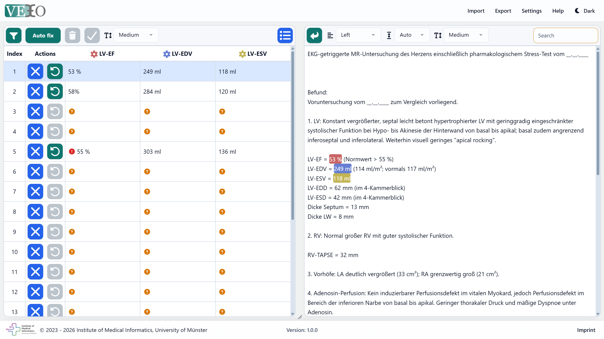

# VETO - Verified Text Annotation Tool

VETO (Verified Text Annotation Tool) is a web-based text annotation tool for creating and verifying text annotations.
Its key features are:

- Annotation and highlighting of texts as well as definition of additional meta-information.
- Verifying and correcting pregenerated annotations generated by LLMs.
- Automatically tagging the position of LLM-generated annotations, even with small alterations typical of LLM outputs.
- Protecting the data by keeping everything locally in the browser.




## Demonstration
A demonstration is available at: https://imi-ms.github.io/VETO/

## Documentation
VETO's documentation is available inside the application in the "Help" menu in the top navigation bar.
You can use the demonstration server linked above.

## Installation
VETO is a single-page application, so all you have to do is to serve the static resources.
You can find pre-build resources on the release page: https://github.com/imi-ms/VETO/releases

## Build VETO yourself

If you want to build VETO yourself or start developing, you have to first set up the development environment.

1. Install node >=22.12.0.

2. Install packages.
``` bash
npm install

```
3. Start a local server with hot-reloading.
``` bash
npm run dev
```

4. Build VETO.
By default, the base path is set to `./`, which is suitable for hosting VETO on a subpath of a domain.
However, you can overwrite the base path by setting the environment variable `VITE_BASE` for the build process.

``` bash
npm run build
```
A new `dist` folder will be created in the project's root directory, containing the static resources.

## License

VETO is licensed under the [Apache-2.0 license](LICENSE).

## Third party libraries
VETO uses the following open-source libraries:
- [Vue.js](https://github.com/vuejs/core)
- [Pinia](https://github.com/vuejs/pinia)
- [core-js](https://github.com/zloirock/core-js)
- [Bootstrap](https://github.com/twbs/bootstrap)
- [Font Awesome](https://github.com/FortAwesome/Font-Awesome)
- [Highlight.js](https://github.com/highlightjs/highlight.js)
- [Highlight.js plugin for Vue.js](https://github.com/highlightjs/vue-plugin)
- [vue-multiselect](https://github.com/shentao/vue-multiselect)
- [Papa Parse](https://github.com/mholt/PapaParse)
- [VuePapaParse](https://github.com/twickstrom/vue-papa-parse)
- [exceljs](https://github.com/exceljs/exceljs)
- [Vite](https://github.com/vitejs/vite)

## Credits
VETO was developed by the Medical Data Integration Center (MeDIC), Institute of Medical Informatics, University of Münster

Medical Data Integration Center (MeDIC)<br>
Institute of Medical Informatics<br>
University of Münster<br>
Albert-Schweitzer-Campus 1, Gebäude A11<br>
48149 Münster<br>
[medic@uni-muenster.de](mailto:medic@uni-muenster.de)<br>
0251 / 83 – 5 57 22
